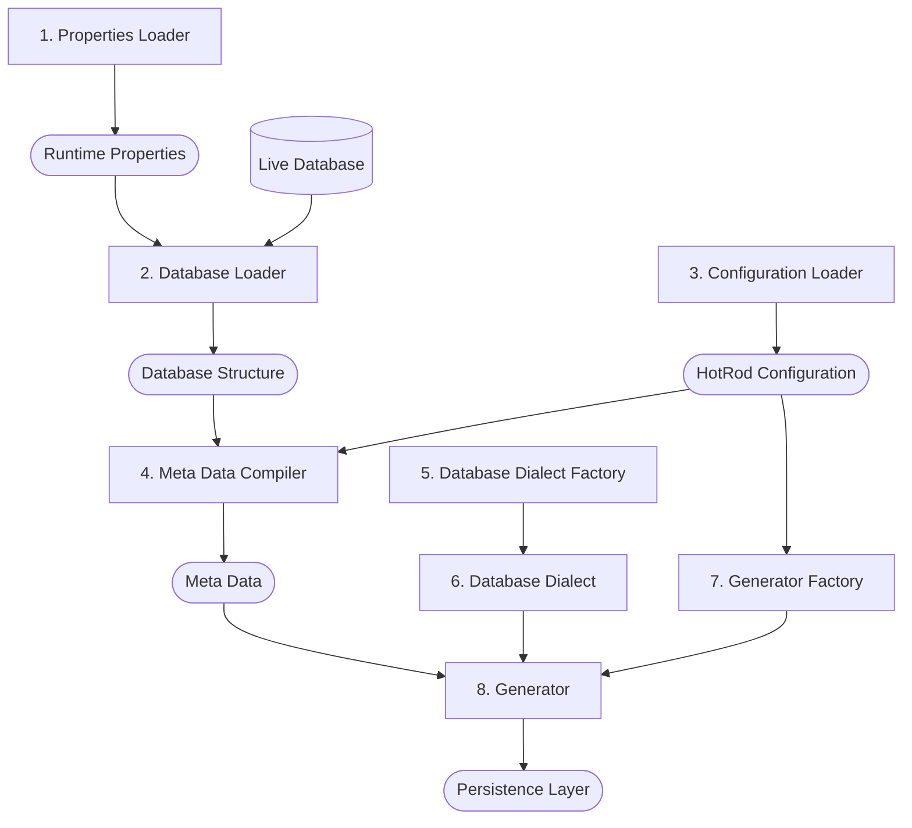

# The Internal Architecture of Generator

To make the generator highly configurable the meta data is compiled first from multiple sources. Namely:

- Runtime Properties
- Live Database
- HotRod Layer Configuration

Then:

1. Once the meta data is compiled and validated, the dialect is prepared for the specific database.
2. Then, the specific generator is instantiated and fed with the meta data and the dialect.
3. Finally, with all those moving parts in place, the generator produces the persistence layer.

This can be visualized as:

