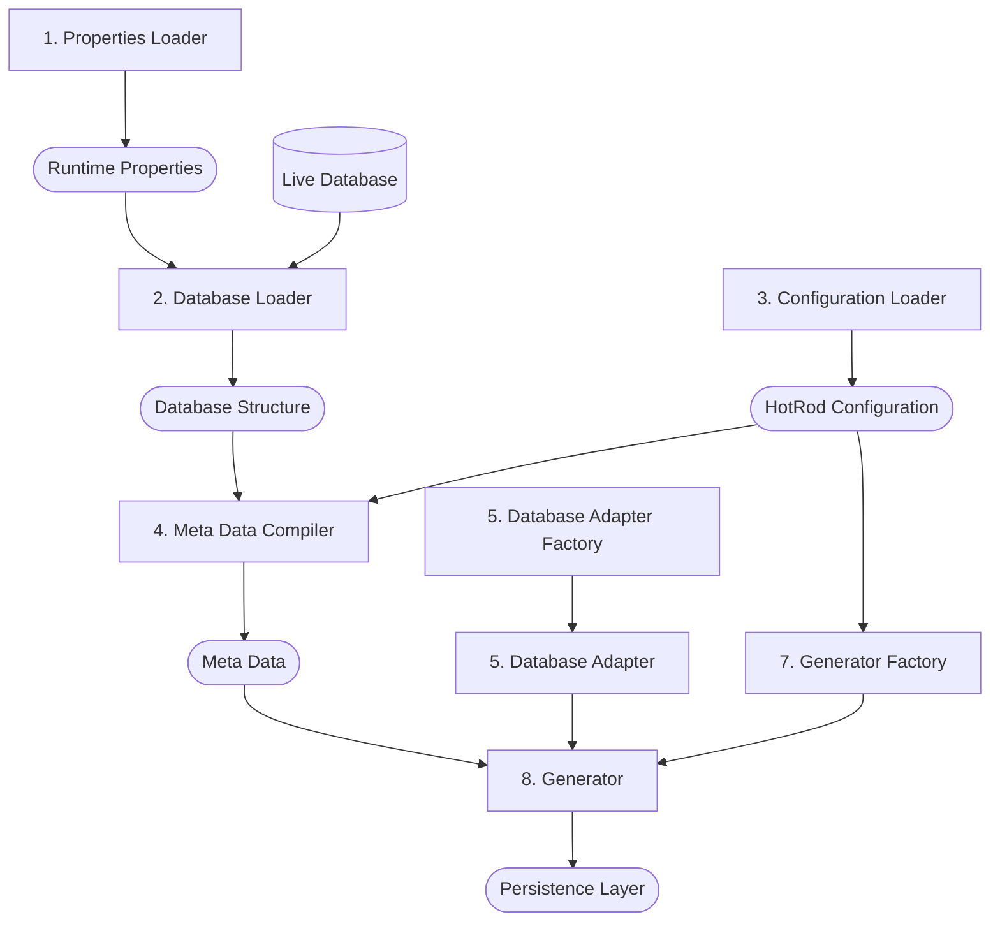

# The Internal Architecture of Generator

To make the generator highly configurable the meta data is compiled first from multiple sources. Namely:

- Runtime Properties
- Live Database
- HotRod Layer Configuration

Once the meta data is compiled and validated, the dialect adapter is prepared for the specific database. Then the specific generator is instantiated and fed the meta data and the dialect adapter. With all those moving parts, the generator generates the persistence layer.

The explanation above can be visualized as:

