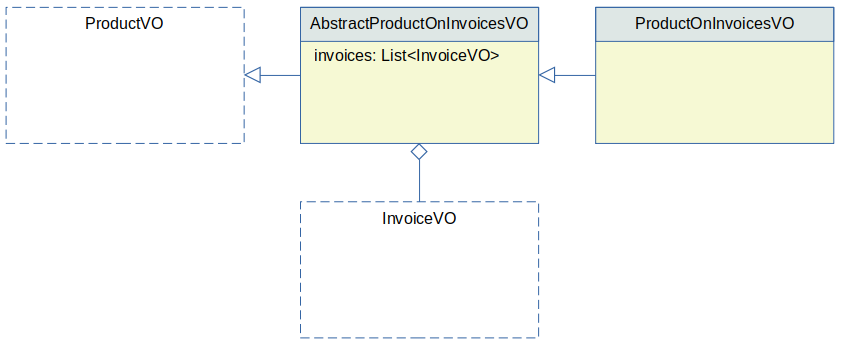

# Collections

Collections are quite powerful constructs, that can dramatically reduce tedious, repetitive coding that handles 1:M relationship between tables.

A `<collection>` tag is a special kind of `<vo>` tag. Its represents a `<vo>` tag that has a M:1 relationship with its parent `<vo>` tag. 


## Example

The following query retrieves account VOs, where each account VO includes a list of transaction VOs:

```xml
<dao name="NightlyQueriesDAO">

  <select method="retrieveWithAccountsTransactions">
    select
      <columns>
        <vo table="account" extended-vo="EnhancedAccountVO">
          a.*
          <collection table="transaction" property="txs" alias="t" />
        </vo>
      </columns>
    from account a
    join transaction t on t.account_id = a.id
    order by a.id
  </select>
  
</dao>
```

In this example:

 - The method returns a `List<EnhancedAccountVO>`; the newly generated `EnhancedAccountVO` class extends `AccountVO`, thus inheriting all its behavior.
 - Apart from all the properties from `AccountVO`, the `EnhancedAccountVO` includes an extra one: `txs`.
 - The `txs` property is a `List<TransactionVO>`, where `TransactionVO` is an existing type with any custom behavior.


It's crucial that the result set is returned in order, so the `ORDER BY a.id` clause included in the example above is essential. The engine considers a new `AccountVO` needs to be produced when the value of its primary key changes. Therefore if rows of the same `AccountVO` show up separated in the result set, the resulting `List<EnhancedAccountVO>` will include multiple, separated instances of the same `AccountVO`, producing a probably undesired data structure.

Note that all rules described before also apply for these queries:
 - Not all columns need to be included.
 - Parameters can be added.
 - Classes and converters can be specified.


## The 1:N Relationship of the Result Set

Nitro considers the VO from the parent `<vo>` tag as the *primary* (technically the *driving*) VO. A nested `<collection>` type VO is considered *secondary*; if this VO includes other nested `<collection>` this is considered a tertiary VO, and so on.

If not specified Nitro identifies each different occurence of the primary VO by it's primary key columns alone. It does not compare all the columns produced by the query, to determine if we are still on the same object or if we started the next one. Therefore:

 - If it determines it's still on the same one, it does not produce a new primary VO but keeps the existing one; it does produce a new instance of the secondary VO for this row, and adds it to the `List<>` of the primary VO.
 - If it determines it found a new primary VO, it creates a new primary VO, and also adds the first VO to the `List` of the secondary VOs.
 
The description above applies to more that two levels of VOs for nested collections.

Now, the 1:N relationship in the result set does not actually represents a 1:N the data model itself: it's only for the result set purposes. For example consider a N:M relationship between two tables. The result set of a query can consider the data having a 1:N relationship and that's suitable enough for HotRod to retrieve it as a 1:N VO structure. For example:

```xml
<dao name="NightlyQueriesDAO">

  <select method="getProductInvoices">
    select
      <columns>
        <vo table="product" extended-vo="ProductOnInvoicesVO">
          p.*
          <collection table="invoice" property="invoices" alias="i" />
        </vo>
      </columns>
    from invoice i
    join invoice_product ip on ip.invoice_id = i.id
    join product p on p.id = ip.product_id
    order by p.id
  </select>
  
</dao>
```

The model does not have a 1:N relationship between `product` and `invoice` but the query assembles it that way. The `<collection>` tag picks it up and generates:

 - A new method `getProductInvoices()`.
 - The return type of the method is `List<ProductOnInvoicesVO>`.
 - `ProductOnInvoicesVO` extends `ProductVO` to include the property `invoices` of type `List<Invoices>`.
 

 