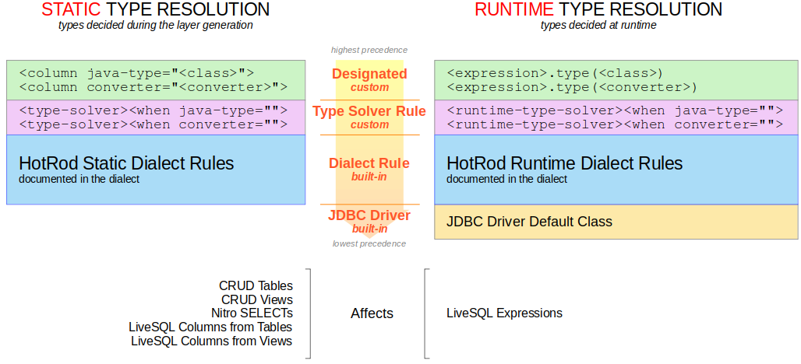

# Type Resolution Mechanics

When a SELECT query is run the persistence layer models the columns of it with specific data types in your app. These data types typically take the form of statically defined properties in the Layout classes, but can also appear as dynamic columns in LiveSQL queries.

See the [Hello Type Solver](./hello-typesolver.md) runnable example to see all the type resolution cases described below in action.

## 1. The Rules and Their Precedence

HotRod implements a clear set of rules to decide the type for each column. In short, the list &ndash; sorted from highest to lowest precedence &ndash; is:

- Precedence #1 &ndash; User-Designated Type
- Precedence #2 &ndash; User-Defined Type Solver Rules
- Precedence #3 &ndash; Database Dialect Rules
- Precedence #4 &ndash; JDBC Driver Default Type

The first two types (with highest precedence) are optional and can be customized by the developer. The third one is internally defined in HotRod by each specific database dialect, and documented in each dialect. The last one is decided by the specific JDBC driver used at runtime.

When determining the type of a column the Type Resolution Mechanics will follow the rules according to the precedence. The first one that matches wins, and the rest are ignored.

This strategy allows higher-precedence rules to be implemented for specific types, while keeping lower-precedence rules in place as a default for other cases.

## 2. Static &amp; Runtime Type Resolution

In some cases this class modeling is done during the generation of the persistence layer &ndash; that is, in a *static* manner &ndash; while in other cases it's performed when the query is run &ndash; that is, at *runtime*.

### 2.1 Static Type Resolution

The static type resolution is computed during the generation of the persistence layer. It affects:

- The columns of all CRUD tables
- The columns of all CRUD views
- The columns of all Nitro SELECTs &ndash; the static and also the dynamic ones
- The columns in LiveSQL SELECT queries that correspond to CRUD tables
- The columns in LiveSQL SELECT queries that correspond to CRUD views

Again, the type of these columns is set in stone during the generation of the persistence layer and is not affected by the runtime environment.

*Note*: if you generated the persistence layer with development database with tables that differs from the production database (a very bad practice), the static types will behave according to the development database, even in production.

You can inspect rules that computed each static types in each Layout class for a table, a view, or a Nitro SELECT query. Each property of a Layout class includes a comment with the rule that was used to decide its type.

### 2.2 Runtime Type Resolution

The runtime type resolution is computed during the execution of a LiveSQL SELECT query. It affects:

- LiveSQL Expressions

The type of these columns will be computed at runtime using the rules according to precedence defined before.

*Note*: if you generated the persistence layer with development database with tables that differs from the production database (a very bad practice), the runtime types will behave according to the production database and **may differ** from the ones in lower environments.

You can inspect the runtime types by enabling logging in LiveSQL. The SELECT query includes the details of the columns, including the rule that was used to decide its type.

## 3. Types &amp; Converters

Specifying casting types for columns work in a different way compared to converters.

### 3.1 Casting Types

Casting types can work well when the transformation of data values happen **in the same domain of values**. For example:

- From a number to another number, maybe with different precision, scale, or representation (fixed or floating point)
- From a TIMESTAMP to a DATE or vice versa, by adding or losing precision
- By adding or removing time zone information in a TIMESTAMP or TIME value
- Between compatible binary types; e.g. a UUID that can be represented as a byte array

Depending on the specifics of each database there are many cases that fall in the "cast" category; that is, between types that can be considered fully or somewhat compatible.

In these cases, the compatible data type can be specified by any of the rules above. The query **will instruct** the JDBC driver to read from the database with the data already cast. There's no need for your application or the persistence layer to do any extra work.

### 3.2 Converters

Converters, on the other hand, convert values from one domain **to a different domain of values**. For example:

- From an CHAR value that represents a status to an *enum* value that represent the corresponding status in your app
- From a numeric value that can be zero or one to a Boolean value in your app
- Or maybe from a Y/N CHAR value to a Boolean value in your app
- From an ARRAY of values in the database to an array of values in your app

Converters implement the conversion back and forth between the domains, so they can be used when reading data from the database &ndash; when *decoding* &ndash; and when writing data to the database &ndash; when *encoding*.

Converters can only be specified in Precedence #1 and #2 in the rules above. That is, they can be designated or computed by a type solver rule (either static or runtime one). The dialect rules and the JDBC driver do not use them.

#### In CRUD

When converters are used in CRUD queries to retrieve data from the database, the JDBC driver is instructed to retrieve the data using the *raw type* and then the converter decodes this raw value into the domain value that your app sees.

When converters are used in CRUD queries to write data to the database (e.g. an INSERT, UPDATE, or a WHERE predicate in a query), the domain values your application specifies are first encoded by the converters into raw values, and then these raw values are applied to the actual query.

#### In LiveSQL

Converters also affect LiveSQL queries. Any LiveSQL INSERT, UPDATE, DELETE, or SELECT encodes domain values into raw values before applying them to the actual queries.

When using converted columns in a LiveSQL predicate or any LiveSQL expression, the operator available are reduced to a minumum to ensure compatibility during the domain transformation of values. That is, only the operators corresponding to `=`, `<>`, `IN`, `NOT IN`, `EXISTS` and `NOT EXISTS` can be used.

## 4. Everything Combined

The type resolution mechanics combines all the aspects described above. Namely:

- Rules Precedence that consider user-designated types, user-defined type solver rules, database dialect rules, and JDBC driver default types
- Static and Runtime Type solvers
- Type Casting and Converters

These aspects combined make all 11 cases, as depicted in the image below:

&nbsp;

&nbsp;

The following table describes their name as shown in the application, as well as their precedence, nature, and usage:

| Case | Name | Nature | Precedence | Usage |
| :--: | :-- | :--: | :--: | :-- |
| 1 | STATIC_DESIGNATED to *type* | Static | #1 | Specified in a `<column>` Tag |
| 2 | STATIC_DESIGNATED to *converter* | Static | #1 | Specified in a `<column>` Tag |
| 3 | STATIC_TYPESOLVER_RULE to *type* | Static | #2 | Specified in a `<type-solver>` Tag |
| 4 | STATIC_TYPESOLVER_RULE to *converter* | Static | #2 | Specified in a `<type-solver>` Tag |
| 5 | STATIC_DIALECT_RULE | Static | #3 | Enabled by default in the dialect |
| 6 | RUNTIME_DESIGNATED to *type* | Runtime | #1 | Specified with a `.type(<class>)` expression |
| 7 | RUNTIME_DESIGNATED to *converter* | Runtime | #1 | Specified with a `.type(<converter-bean>)` expression |
| 8 | RUNTIME_TYPESOLVER_RULE to *type* | Runtime | #2 | Specified in a `<runtime-type-solver>` Tag |
| 9 | RUNTIME_TYPESOLVER_RULE to *converter* | Runtime | #2 | Specified in a `<runtime-type-solver>` Tag |
| 10 | RUNTIME_DIALECT_RULE | Runtime | #3 | Enabled by default in the dialect |
| 11 | RUNTIME_JDBC_DRIVER_DEFAULT | Runtime | #4 | Enabled by default in the JDBC driver |

Due to their identical precedence the syntax of the configuration file makes cases #1 and #2 mutually exclusive. The same happens with cases #3 and #4.

On the other hand, the LiveSQL syntax makes cases #6 and #7 mutually exclusive, as well as cases #8 and #9.

Again, you can inspect and run the [Hello Type Solver](./hello-typesolver.md) example to see all the type resolution cases in action.

