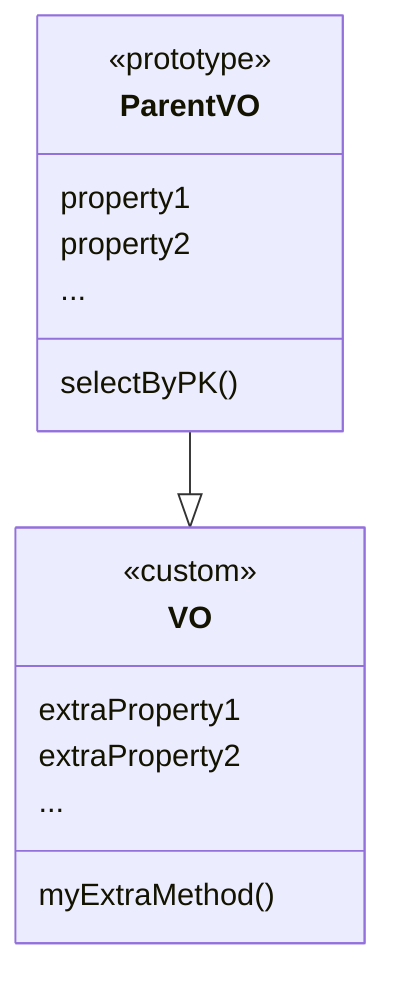

# Value Object Modeling

This is a key concept that CRUD implements to keep the Java model in sync with the database changes while
at the same time keeping the developer's custom code added to the VOs safe.

CRUD models a value object as two separate classes:

- A *parent class* that mimics the database structure with all properties from the database and no methods for
behavior.
- An initially empty *child class* where extra properties and methods can be added.

All custom logic is concentrated in the child class, while the parent represents the database structure. 

When run for the first time CRUD generates both classes. Later on, when database changes happen CRUD always
rewrited the parent class to reflect the latest database structure, but never overwrites the child class
where all custom properties or method reside.

This way the developer's custom code remains safe while at the same time the VO model can be constantly kept
up to date.

## Nitro

Nitro flat selects and structured selects produce value objects as well. Even when having a more fleeting nature
these value objects still follow the same strategy of parent-child relationship. Extra properties and behavior
can be added to them as needed.

