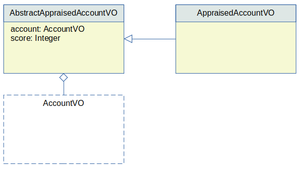

# Extra Expressions  

Computed columns can also be added to the structured columns using the `<expression>` tag.

These columns are added to the enclosing VO, that must be included in this case.

## Example

The following example adds an extra column to the resulting VO that represents the row:

```xml
<dao name="NightlyQueriesDAO">

  <select method="retrieveActiveAccounts">
    select
      <columns vo="AppraisedAccountVO">
        <vo table="account" property="account" alias="a" />
        <expression property="score">
          balance / 3000 + credit / 200
        </expression>
      </columns>
    from account a
    where a.active = 1
  </select>
  
</dao>
```
 
This example:

 - Requires an enclosing VO: `AppraisedAccountVO` in this case.
 - The enclosing VO will have two properties: `account` and `score`.
 - The type of the property `score` is automatically discovered, but can be specified using the optional `<expression>` attributes `class` or `converter`. 
 - Any number of `<vo>` tags can be included with any number of extra `<expression>` tags as long as their names do not collide with other expressions, or with the properties for each `<vo>` tag.
 

