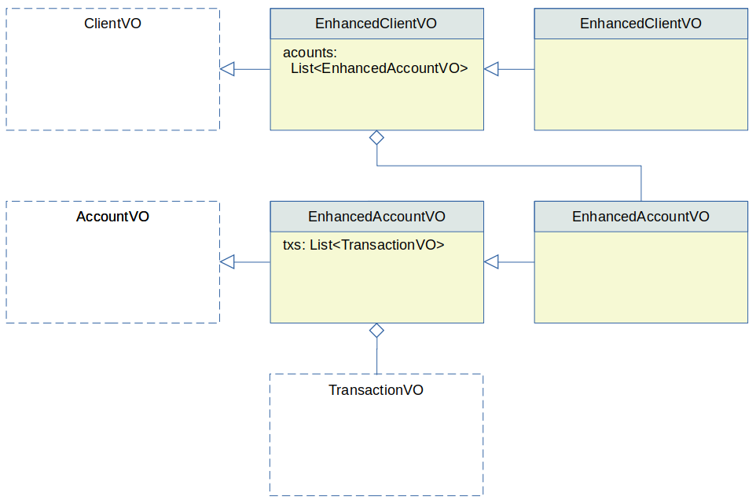

# Nested Collections

A `<collection>` tag can also be included inside another `<collection>` tag when multiple nesting levels are needed.


## Example

The following query retrieves client VOs, where each client VO includes a list of account VOs. Each account VO in its 
turn includes a list of transaction VOs:

```xml
<dao name="NightlyQueriesDAO">

  <select method="retrieveWithAccountsTransactions">
    select
      <columns>
        <vo table="client" extended-vo="EnhancedClientVO">
          c.*
          <collection table="account" property="accounts" extended-vo="EnhancedAccountVO">
            a.*
            <collection table="transaction" property="txs" alias="t" />
          </collection>
        </vo>
      </columns>
    from client c
    join account a a.client_id = c.id
    join transaction t on t.account_id = a.id
    order by c.id, a.id
  </select>
  
</dao>
```
 
In this example:

 - The method returns a `List<EnhancedClientVO>`.
 - The new `EnhancedClientVO` class extends the existing `ClientVO` class, to include the new property `accounts` of type `List<EnhancedAccountVO>`.
 - The new `EnhancedAccountVO` class extends the existing `AccountVO` class, to include the new property `txs`, of type `List<TransactionVO>`.

Notice the `ORDER BY` clause ensures the grandparent, parent, and child values are sorted correcly.


