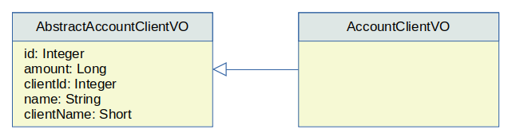

## Nitro Flat SELECTs

A Nitro Flat SELECT is the simplest and probably the most useful and common form of the &lt;select> tag. It models the resulting rows as fully named, fully typed value 
objects. The execution typically returns a `java.util.List` of these value objects, though it can also return a cursor or even a single object.

For example:

```xml
<dao name="WebQueriesDAO">

  <select method="findActiveAccountsWithClient" vo="AccountClientVO">
    select a.*, c.name, c.type as "client_type"
    from account a
    join client c on c.id = a.client_id
    where a.active = 1
  </select>
  
</dao>
```

This select specifies that:

 - A new `WebQueriesDAO` class will be generated.
 - This DAO will include the method `findActiveAccountsWithClient` to execute this query.
 - The method will return a `List&lt;AccountClientVO>`.
 - The abstract value object `AbstractAccountClientVO` will be generated. It will include all columns of the result set as fully 
 typed Java, fully named Java properties. 
 - A concrete value object will be also generated, so the developer can add custom properties and behavior. **Important**: this concrete value object is never updated when/if the HotRod generation is executed again and again; in other words, any custom change written by the developer is safe here.

As an example, the &lt;select> tag above could produce the value objects:

    

```java
public class AbstractAccountClientVO {
  protected Integer id = null;
  protected Long amount = null;
  protected Integer clientId = null;
  protected String name = null;
  protected Short clientType = null;
  // getters and setters omitted
}

@Component
public class AccountClientVO extends AbstractAccountClientVO {
  // Add custom properties and behavior here
} 
```

Additionally, the generated DAO class that will expose the specified method could look like:

```java
@Component
public class WebQueriesDAO implements Serializable, ApplicationContextAware {

  public List<AccountClientVO> findActiveAccountsWithClient() {
    ...
  }
  
}
```

## Query Fetch Mode

Flat Selects can work with three fetch modes: list, cursor, and single-row.

### The `list` mode

The `list` mode is the default mode and returns a `List<VO>` (formally a `java.util.List`). 

This mode reads all the rows returned by the query into memory, assembles a list, and returns this list
to the caller.

**Note**: This strategy can become a memory hog if the query returns a massive number of rows; in cases like this sometimes the `cursor` mode can be of use.

Example:

```xml
<select method="findOldAccounts" vo="OldAccountVO">
  ...
</select>
```

Equivalent to:

```xml
<select method="findOldAccounts" vo="OldAccountVO" mode="list">
  ...
</select>
```

This example produces a Java method like:

```java
public List<OldAccountVO> findOldAccounts() {
  ...
}
```

### The `cursor` mode

The `cursor` mode returns a `Cursor<VO>` (formally a `org.hotrod.runtime.cursors.Cursor`).

The `Cursor` object is a forward-only, iterable object that uses a buffer 
to receive a limited number of rows at a time from the query, thus limiting the amount of allocated memory at any given time.
Cursors can be a memory-efficient solution for processes that handle massive number of rows that need to be
**read, processed, and discarded immediately**.

**Note**: The memory efficiency benefit of a cursor is not leveraged if the process ends up assembling all the rows
into a `List` (or other `Collection`-like) data structure that will hold all the rows in memory anyway.

Example:

```xml
<select method="findOldAccounts" vo="OldAccountVO" mode="cursor">
  ...
</select>
```

This example produces a Java method like:

```java
public Cursor<OldAccountVO> findOldAccounts() {
  ...
}
```

### The `single-row` mode

The `single-row` mode returns a single `VO`, not a `List`, not a `Cursor`.

It assumes the query returns zero or one row at most. 

**Note**: It's the responsibility of the developer to ensure the query returns at most one row. If at runtime the query returns more than a single row, the query is considered failed and an exception is thrown, with a message such as:

> Expected one result (or null) to be returned by SELECT, but found: 3

Example:

```xml
<select method="getHighestPayedEmployee" vo="EmployeeVO" mode="single-row">
  select * from employee order by salary desc limit 1
</select>
```

This example produces a Java method like:

```java
public EmployeeVO getHighestPayedEmployee() {
  ...
}
```
    
## Native SQL

Since the beginning Flat Selects were geared towards using all bells & whistles a database engine has to offer. HotRod allows the developer to include the full SQL syntax the database accepts so the query can benefit from database-specific tricks. This includes any special addition, such as hints, extra clauses, quirky syntax, etc.

For example, DB2 enhances parameterized filtering predicates with the `SELECTIVITY` clause as shown below:

```xml
<select method="getHighestPayedEmployee" vo="EmployeeVO" mode="single-row">
  <parameter name="minPrice" java-type="Double" />
  <parameter name="maxPrice" java-type="Double" />
  <parameter name="packagingType" java-type="String" />
  select * from widget
  where packaging_type = #{packagingType} selectivity 0.07
    and price between #{minPrice} and #{maxPrice} selectivity 0.00002
</select>
```

By using the `SELECTIVITY` clause the developer is informing the DB2 optimizer that the second filtering predicate `price between #{minPrice} and #{maxPrice}` has a much better selectivity than the first one `packaging_type = #{packagingType}`, something that can seem counterintuitive; when performance comes in play this can be crucial for optimization purposes since the database engine may guess it incorrectly just by analyzing the query and the table histogram, and may end up using the wrong index.

Typically database engines support the most important definitions and clauses specified by the SQL Standard and purposedly neglect the more obscure ones; no database engine implements the SQL Standard in its entirety. On the flip side, engines implement enhanced *non-standard* features that can be very useful in specific scenarios. These extensions should not be seen as a deterioration of the SQL language, but as non-standard *enrichment* of its available features. These features that can be very useful for developers in the present, and some of them may become part of the SQL Standard in the future.

Notwithstanding their benefits, the usage of SQL extensions can limit the possibilities of migrating to a different database engine should the application owner decide to pursue this avenue in the future. 

## Parameters 

Flat Selects accept parameters by adding the `<parameter>`   tag.

For example, a Flat Select that includes two parameters can look like:

```xml
<select method="findSoldCars" vo="CarVO">
  <parameter name="branchId" java-type="Integer" />
  <parameter name="fromDate" java-type="java.util.Date" />
  select * from car where branch_id = #{branchId} and sold_date >= #{fromDate}
</select>
```

This Flat Select produces a Java method like:

```java
public List<CarVO> findSoldCars(Integer branchId, java.util.Date fromDate) {
  ...
}
```

See [Nitro Parameters](nitro-parameters.md) for details and examples.  

## Property Names

The resulting value object will include one property for each column of the result set. The property names are automatically produced by HotRod, but can also be affected by the global [Name Solver](../config/tags/name-solver.md), or by a `<column>` tag added to the query. They are processed in order:

1. If a `<column>` tag includes a `java-name` property, this one decides the property name, and no further processing is performed.
2. If a `<name-solver>` rule matches the column, then it modifies the column name.
3. Finally, HotRod produces a property name based on the original or modified column name.

## Property Types

The resulting value object will include one property for each column of the result set. The property types are automatically produced by HotRod based on the specifics of each database. Nevertheless, they can be affected by the global [Type Solver](../config/tags/type-solver.md), or by a `<column>` tag added to the query. They are processed in order:

1. If a `<column>` tag includes a `java-type` property, this one decides the property type, and no further processing is performed.
2. If a `<column>` tag includes a `converter` property, this one produces the property type according to its rules, and no further processing is performed.
3. If a `<type-solver>` rule matches the column, then it decides the property type, and o further processing is performed.
4. Finally, if none of the above rules decides the property type, HotRod produces a property type based on the column type and the specific database engine.

## Dynamic SQL

Flat Selects can include optional SQL Fragments that are included or excluded according to boolean logic based on the value of runtime parameters.

For example, a Flat Select that includes Dynamic SQL can look like:

```xml
<select method="searchOrders" vo="OrderVO">
  <parameter name="minPrice" java-type="Double" />
  <parameter name="maxPrice" java-type="Double" />
  <parameter name="fromDate" java-type="java.util.Date" />
  <parameter name="toDate" java-type="java.util.Date" />
  select * from orders
  <where>
    <if test="minPrice != null">and order_price >= #{minPrice}</if>
    <if test="maxPrice != null">and order_price &lt;= #{maxPrice}</if>
    <if test="fromDate != null">and order_date >= #{fromDate}</if>
    <if test="toDate != null">and order_date &lt;= #{toDate}</if>
  </where>      
</select>
```

This Flat Select produces a Java method like:

```java
public List<OrderVO> searchOrders(Double minPrice, Double maxPrice, java.util.Date fromDate, java.util.Date toDate) {
  ...
}
```

The `<where>` tag shown above will produce a SQL `WHERE` clause that includes the inner `<if>` tags conditionally according to the `test` conditions evaluated at runtime, and according to the parameters of each call. The `test` attributes uses `OGNL` syntax (See [Apache OGNL](https://commons.apache.org/proper/commons-ognl/language-guide.html)).

Notice the `<where>` tag will automatically remove the `and` prefix of the first included `<if>` tag at runtime. Also, If no inner tag is included at runtime, the whole `<where>` clause is excluded.

Dynamic SQL can be included anywhere in the SQL statement, not just in the `WHERE` clause. However, HotRod requires that the resulting query produced at runtime always return the same columns.

See [Dynamic SQL](../nitro/nitro-dynamic-sql.md) for more details.  


 


 

  

