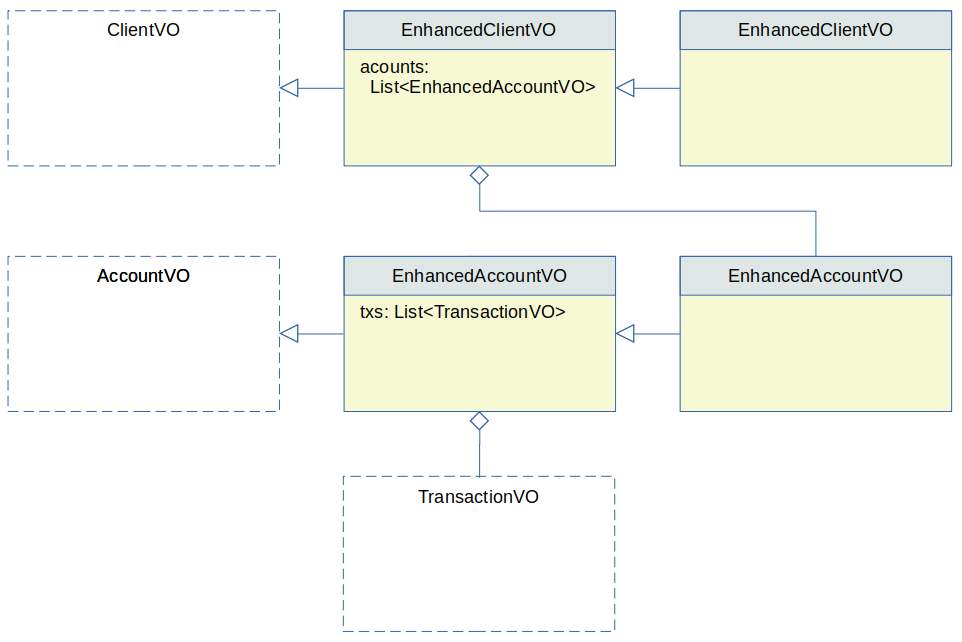

## Nitro Structured Selects

Nitro Structured Selects enhance the flat select model by adding a structure to the result set. Instead of
a List of VOs, these queries can return fully named, fully typed compounded VOs and/or tree-like structures 
of VOs using collections and association tags.

This strategy can be very effective to resolve the "N + 1" problem when accessing data. It does have drawbacks 
so care needs to be take to make the most of this strategy.

## Preserving Behavior by Returning Multiple VOs per Row

Typically, the developer will enhance the behavior of the value objects, maybe adding properties, maybe adding 
methods. However, the VOs produced by a flat SELECT don't include these additional properties or behavior; a 
flat SELECT includes all the columns of the query, but produces a whole different VO that is unrelated to the 
main VO of the table.

Structured SELECTs can capture the columns of a SELECT statement in one or more table (or view) VOs. For example, 
the query below:

```xml
<dao name="NightlyQueriesDAO">

  <select method="retrieveAccountsClient">
    select
      <columns vo="AcctClientVO">
        <vo table="account" property="account" alias="a" />
        <vo table="client" property="client" />c.name, c.type</vo>
      </columns>
    from account a
    join client c on c.id = a.client_id
    where a.active = 1
  </select>
  
</dao>
```

This select specifies:

 - A new `NightlyQueriesDAO` class will be generated.
 - Note that the main tag does not include a `vo` attribute, as in flat selects.
 - This DAO will include the method `retrieveAccountsClient` to execute this query.
 - The method will return a `List&lt;AcctClientVO>`, that is a **new** VO generated by HotRod.
 - However, this new VO will only have two properties: `account` and `client`, not all the columns of the resulting query.
 - The query will use the `<vo>` tags to include the columns of the tables.
 - The `account` and `client` properties will be of the **existing** types `AccountVO` and `ClientVO`, that are already defined by the &lt;table> and/or &lt;view> tags.
 - Naturally, the `AccountVO` and `ClientVO` will include all extra behavior added by the developer.
 

 
Also consider:
 
 - If multiple VOs have columns with the same name HotRod automatically handles the case behind the scenes, by using different name spaces for each table.
 - The developer needs to take proper care to ensure the corresponding columns generated by the `<vo>` tag will be available from the FROM or JOIN clauses of the query. For example, the tag `<vo table="account" alias="a" />` requires that the query should name the table `account` with alias `a` in the FROM or JOIN clause. If not present, the rendered query won't be valid since the produced columns won't be valid. In this case, HotRod will show an error and will present the fully rendered query for revision.
 - If the `alias` property is specified all columns of the vo are included and the &lt;vo> tag doesn't need any body (as in the `account` VO above).
 - If the `alias` property is not specified the body of the &lt;vo> tag needs to include the entirety or a subset of the properties (as in the `client` VO above). This can be useful in the case of heavy properties that are not needed for this specific query. Of course, any excluded property will result is a `null` value in the Java VO property. The developer needs to ensure this partial data load leaves the VOs in a suitable state for further processing. 
 
In terms of parameters, Structured SELECTs follow the same rules as Flat SELECTs: they use the &lt;parameter> and &lt;complement> tags in the same way.
 
## Single VO Return - No Need for New Enclosing VO

Now, if the &lt;columns> tag includes a single VO, then there's no need to create an artificial enclosing VO and all columns can be returned under this existing VO. For example:

```xml
<dao name="NightlyQueriesDAO">

  <select method="retrieveActiveAccounts">
    select
      <columns>
        <vo table="account" alias="a" />
      </columns>
    from account a
    where a.active = 1
  </select>
  
</dao>
```

The method `retrieveActiveAccounts` does not define new VOs, but reuses the existing VO and returns a `List<AccountVO>`. This VO includes all custom behavior the developer may have added.

The same rules shown in the previous case apply. Not all columns need to be retrieved, and parameters can be applied.

The "Single VO return" must be read as "columns belonging to a single VO", not as "returning a single row". Structured Selects are assumed to return multiple rows in a List structure.

## Query Return Mode

Unlike Flat Selects, Structured Selects can only use the `list` mode.

## Extra Expressions  

Computed columns can be added to the structured columns using the &lt;expression> tag. These columns are added to the enclosing VO, that must be included in this case. For example:

```xml
<dao name="NightlyQueriesDAO">

  <select method="retrieveActiveAccounts">
    select
      <columns vo="AppraisedAccountVO">
        <vo table="account" property="account" alias="a" />
        <expression property="score">
          balance / 3000 + credit / 200
        </expression>
      </columns>
    from account a
    where a.active = 1
  </select>
  
</dao>
```
 
This example:

 - Requires an enclosing VO: `AppraisedAccountVO` in this case.
 - The enclosing VO will have two properties: `account` and `score`.
 - The type of the property `score` is automatically discovered, but can be specified using the optional `<expression>` attributes `class` or `converter`. 
 - Any number of &lt;vo> tags can be included with any number of extra &lt;expression> tags as long as their names do not collide with other expressions, or with the properties for each &lt;vo> tag.
 


## Collections

Collections are quite powerful constructs, that can dramatically reduce tedious, repetitive coding that handles 1:n relationship between tables.

A `<collection>` tag is a special kind of `<vo>` tag. Its represents a `<vo>` tag that has a n:1 relationship with its external `<vo>` tag. 

For example:

```xml
<dao name="NightlyQueriesDAO">

  <select method="retrieveWithAccountsTransactions">
    select
      <columns>
        <vo table="account" extended-vo="EnhancedAccountVO">
          a.*
          <collection table="transaction" property="txs" alias="t" />
        </vo>
      </columns>
    from account a
    join transaction t on t.account_id = a.id
    order by a.id
  </select>
  
</dao>
```

In this example:

 - The method returns a `List<EnhancedAccountVO>`; the newly generated `EnhancedAccountVO` class extends `AccountVO`, thus inheriting all its behavior.
 - Apart from all the properties from `AccountVO`, the `EnhancedAccountVO` includes an extra one: `txs`.
 - The `txs` property is a `List<TransactionVO>`, that is an existing type, again with all behavior.


It's crucial that the result set is returned in order, so the `ORDER BY a.id` clause included in the example above is essential. The engine considers a new `AccountVO` needs to be produced when the value of its primary key changes. Therefore if rows of the same `AccountVO` show up separated in the result set, the resulting `List<EnhancedAccountVO>` will include multiple, separated instances of the same `AccountVO`, producing a probably undesired data structure.

Note that all rules described before also apply for these queries:
 - Not all columns need to be included.
 - Parameters can be added.
 - Classes and converters can be specified.

## The 1:N Relationship of the Result Set

HotRod considers the VO from the external `<vo>` tag as the *primary* (technically the *driving*) VO. A nested `<collection>` type VO is considered *secondary*; if this VO includes other nested `<collection>` this is considered a tertiary VO, and so on.

If not specified HotRod identifies each different occurence of the primary VO by it's primary key columns alone. It does not compare all the columns produced by the query, to determine if we are still on the same object or if we started the next one. Therefore:

 - If it determines it's still on the same one, it does not produce a new primary VO but keeps the existing one; it does produce a new instance of the secondary VO for this row, and adds it to the `List<>` of the primary VO.
 - If it determines it found a new primary VO, it creates a new primary VO, and also adds the first VO to the `List` of the secondary VOs.
 
The description above should be extended for more that two levels of VOs.

Now, the 1:N relationship in the result set does not actually represents a 1:N the data model itself: it's only for the result set purposes. For example consider a N:M relationship between two tables. The result set of a query can consider the data having a 1:N relationship and that's suitable enough for HotRod to retrieve it as a 1:N VO structure. For example:

```xml
<dao name="NightlyQueriesDAO">

  <select method="getProductInvoices">
    select
      <columns>
        <vo table="product" extended-vo="ProductOnInvoicesVO">
          p.*
          <collection table="invoice" property="invoices" alias="i" />
        </vo>
      </columns>
    from invoice i
    join invoice_product ip on ip.invoice_id = i.id
    join product p on p.id = ip.product_id
    order by p.id
  </select>
  
</dao>
```

The model does not have a 1:N relationship between `product` and `invoice` but the query assembles it that way. The `<collection>` tag picks it up and generates:

 - A new method `getProductInvoices()`.
 - The return type of the method is `List<ProductOnInvoicesVO>`.
 - `ProductOnInvoicesVO` extends `ProductVO` to include the property `invoices` of type `List<Invoices>`.
 

 
## Nested Collections

A `<collection>` tag can also be included inside another `<collection>` tag when multiple nesting levels are needed.

For example:

```xml
<dao name="NightlyQueriesDAO">

  <select method="retrieveWithAccountsTransactions">
    select
      <columns>
        <vo table="client" extended-vo="EnhancedClientVO">
          c.*
          <collection table="account" property="accounts" extended-vo="EnhancedAccountVO">
            a.*
            <collection table="transaction" property="txs" alias="t" />
          </collection>
        </vo>
      </columns>
    from client c
    join account a a.client_id = c.id
    join transaction t on t.account_id = a.id
    order by c.id, a.id
  </select>
  
</dao>
```
 
In this example:

 - The method returns a `List<EnhancedClientVO>`.
 - The new `EnhancedClientVO` class extends the existing `ClientVO` class, to include the new property `accounts` of type `List<EnhancedAccountVO>`.
 - The new `EnhancedAccountVO` class extends the existing `AccountVO` class, to include the new property `txs`, of type `List<TransactionVO>`.

Notice the `ORDER BY` clause ensures the grandparent, parent, and child values are sorted correcly.



## Associations

An `<association>` tag is a special kind of `<vo>` tag. Its represents a `<vo>` tag that has a 1:1 relationship with its external `<vo>` tag. Thus, it does not require a property of type `List<VO>`, but only of type `VO`. 

It's not required for the *associated* values to be present. An outer join may produce no values related to the driving row. In this case the whole associated VO is null.

It's responsibility of the developer to ensure at most a single associated value is produced by the query. If more than one is produces the behavior is not deterministic, and it will most proably only retrieve the last value.

Associations can also be nested, typically when traversing joins to retrieve a parent row, or a parent of a parent row, and so on.

The use of an `<association>` tag does not require any particular order in the result set.

Example:

```xml
<dao name="NightlyQueriesDAO">

  <select method="findCarsWithOwners">
    select
      <columns>
        <vo table="car" extended-vo="CarWithOwnerVO">
          p.*
          <association table="owner" property="carOwner" alias="o" />
        </vo>
      </columns>
    from car c
    left join owner o on c.owner_id = o.id
  </select>
  
</dao>
```

In this example:

 - Since we are probably navigating a foreign key a car can have at most one owner.
 - The query returns a `List<CarWithOwnerVO>`.
 - The VO `CarWithOwnerVO` extends `CarVO`.
 - The `carOwner` property of the class `CarWithOwnerVO` is of type `OwnerVO`.
 - Since the query uses a `LEFT JOIN` this will include cars without owner. That means the property `carOwner` may be null for some rows.


## Combining Collections and Associations

Collections and associations can be combined and nested in the same query. Collections can include nested collections and associations, while associations can only include nested associations.

When a collection is included, the developer needs to ensure the `ORDER BY` clause is set to ensure the driving tables are retrieved in the appropriate order.

## Associations and Collections Without Primary Keys

Use the `id` attribute to decide which columns act as a VO key.

```xml
<select method="findSingleExpandedAccount" multiple-rows="false">
  select
  <columns>
    <vo table="log" id="recorded_by, recorded_at" extended-vo="LogWithOfficeVO">
      l.*
      <association view="view_office" id="office_id" property="office" alias="o" />
    </vo>
  </columns>
  from log l
  left join view_office o on l.office_id = o.id
</select>
```

When you want to use multiple columns as an artificial key, use a comma-separated value as shown in the exmaple.

## Putting it all together

Well... all those concepts can be put together in a single `<select>` tag.

You can combine collections, associations, expressions, with nested collections, associations, expressions, artificial keys, and parameters in a single complex SELECT.

A combined typical example:

```xml
<select method="selectChannels">
  <parameter name="vendorId" java-type="Integer" />
  select
    <columns>
      <vo table="channel" extended-vo="ExtendedChannel" alias="h">
        <association table="client" property="client" alias="c" />
        <association table="service" property="service" alias="s" />
        <collection table="prefix" property="prefixes" alias="p" />
        <expression property="vip">
          case when h.type in ('T1', 'F', 'G') then 1 else 0 end
        </expression>
      </vo>
    </columns>
    from channel h
    join client c on c.id = h.client_id
    join service s on s.id = h.service_id
    join prefix p on p.channel_id = h.id
    where h.vendor_id = #{vendorId}
</select>
```


